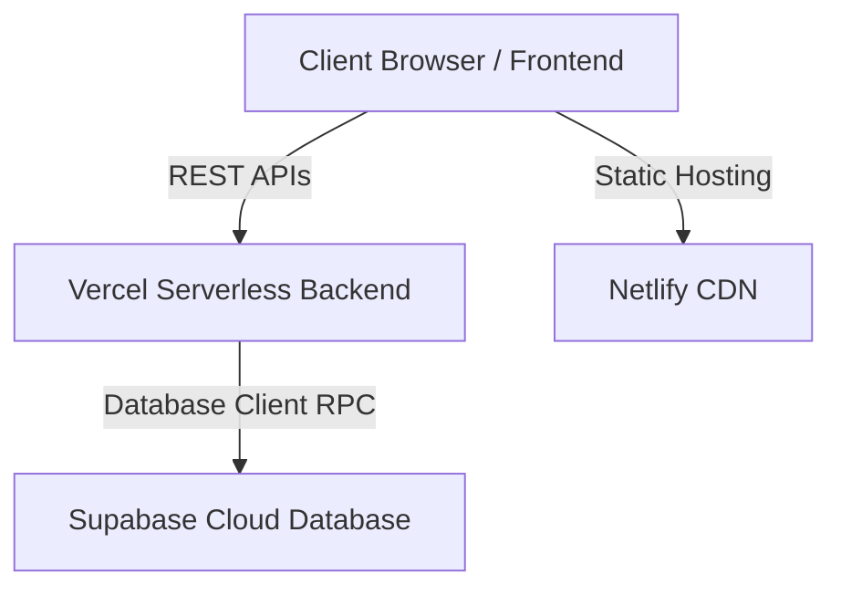

# SmartQueue - Multi-Shop SaaS Queue Management System
## Academic Presentation & Project Report

---

## 1. Project Overview
**SmartQueue** is a modern, real-time Multi-Shop SaaS Queue Management System designed to eliminate physical waiting lines and streamline customer intake. By scanning a dynamic QR code, customers can join a virtual queue, monitor their position in real-time on their mobile devices, and receive automatic audio alerts when it is their turn. Shop owners manage the queue through an interactive live dashboard that displays queue analytics, registers customer departures, exports excel reports, and manages shop settings.

---

## 2. Technology Stack

The project utilizes a decoupled, modern architecture separating the presentation layer from backend business logic and persistence:

### Frontend (Presentation Layer)
*   **HTML5 / Semantic Structure**: Standard structured pages for cross-device compatibility.
*   **CSS3 & TailwindCSS**: A highly refined, responsive, glassmorphic dark-theme user interface inspired by Apple iOS design.
*   **Vanilla JavaScript (ES6+)**: Used for client-side routing, DOM manipulation, storage wrappers, and AJAX integrations.
*   **Chart.js**: Renders responsive graphics for analytics (Weekly Traffic & Comparison).
*   **Web APIs (SpeechSynthesis & Vibration)**: Used for audio queue departure announcements and physical tactile feedback.

### Backend (Logic Layer)
*   **Python (Flask Framework)**: Built as a serverless backend API deployed on Vercel.
*   **PyJWT (JSON Web Tokens)**: Secure, stateless token-based authorization for shop owner console protection.
*   **qrcode (Python library)**: Generates and serves dynamic shop QR codes on the fly.

### Database & Security (Persistence Layer)
*   **Supabase (PostgreSQL Database)**: Relational database storing shops, accounts, and queue records.
*   **PostgreSQL Stored Procedures (PL/pgSQL RPC)**: Handles atomic queue token generations to avoid race conditions.

---

## 3. Core Features Implemented

### A. Dynamic Token Registration (Customer Page)
*   **Optional Customer Details**: Name and WhatsApp details are optional. Customers can choose to share them or simply click a single **Get Token Only** button to register as `"Anonymous"`.
*   **Service Type Removed**: The client registration screen is streamlined by removing the service needed option, resolving queue drop-offs.
*   **Closed Shop Guard**: The registration page queries shop availability. If the shop is closed, registration is blocked and a custom error page is shown.

### B. Relocated Traffic Analytics (3-Dot Settings Menu)
*   To clean up the dashboard, the **Weekly Traffic Analytics** and **Comparison** charts were moved inside a glassmorphic settings modal accessed via a 3-dot options button (`#btn-more-options`).
*   The charts dynamically render when entering the Analytics tab, ensuring Chart.js correctly calculates canvas width/height.

### C. Advanced Settings & Options Modal
*   **Profile Editing**: Owners can update their Owner Name, Shop Name, and phone number directly from the dashboard, saving changes to the backend.
*   **Shop Logo Uploads**: Owners can upload a custom PNG/JPG file as their shop avatar, which renders in the dashboard header and the customer's mobile registration page.
*   **Availability Toggle**: A live status controller (Open/Closed) allowing owners to close the queue.
*   **Voice speed Settings**: Range slider to configure SpeechSynthesis announcement rate.

### D. Audio & Haptic Alerts
*   **Departures**: Plays a text-to-speech departure announcement (*"Thank you for your visit. Come again, and have a safe journey!"*) on both the owner's dashboard and the customer's phone when marked completed.
*   **Turn Announcements**: Speaks ticket numbers when it is their turn (*"Attention please, it is your turn! Token number 5, please proceed to the counter."*) along with physical phone vibration.

### E. Optimized Live Polling
*   Polling in the owner console is optimized from overlapping `setInterval` calls (3s) to non-overlapping recursive `setTimeout` logic (1s) for instant live updates.

---

## 4. Notable Engineering & DB Fallback Implementations

During development, we resolved two critical architectural challenges:

### 1. Dual-Sync Settings Storage (Self-Healing Fallback)
*   **The Problem**: The PostgreSQL database `shops` table was missing columns `is_open` and `profile_photo`. Updating settings threw database errors and failed to persist upon page refreshes.
*   **The Engineering Fix**: We built a fallback key-value store directly inside the `queue` table. 
    *   If database columns do not exist, settings are saved under a dummy system row (`name = "__SYSTEM_SHOP_SETTINGS__"` and `token_number = -999`).
    *   We added filter clauses (`.neq("name", "__SYSTEM_SHOP_SETTINGS__")`) to all dashboard list queries, history logs, analytics calculations, and CSV exports to make this row completely invisible.
    *   If migrations are executed, the system automatically detects the database columns and writes directly to the `shops` table.

### 2. Thread-Safe Event Handlers (Text-to-Speech Engine)
*   **The Problem**: Customer phones played the departure announcement multiple times. This was caused by page visibility changes spawning duplicate intervals, resulting in overlapping fetches.
*   **The Engineering Fix**: We corrected the interval assignment scope and introduced a state flag (`isCompletionAlerted = false`) to guarantee the announcement plays exactly once.
